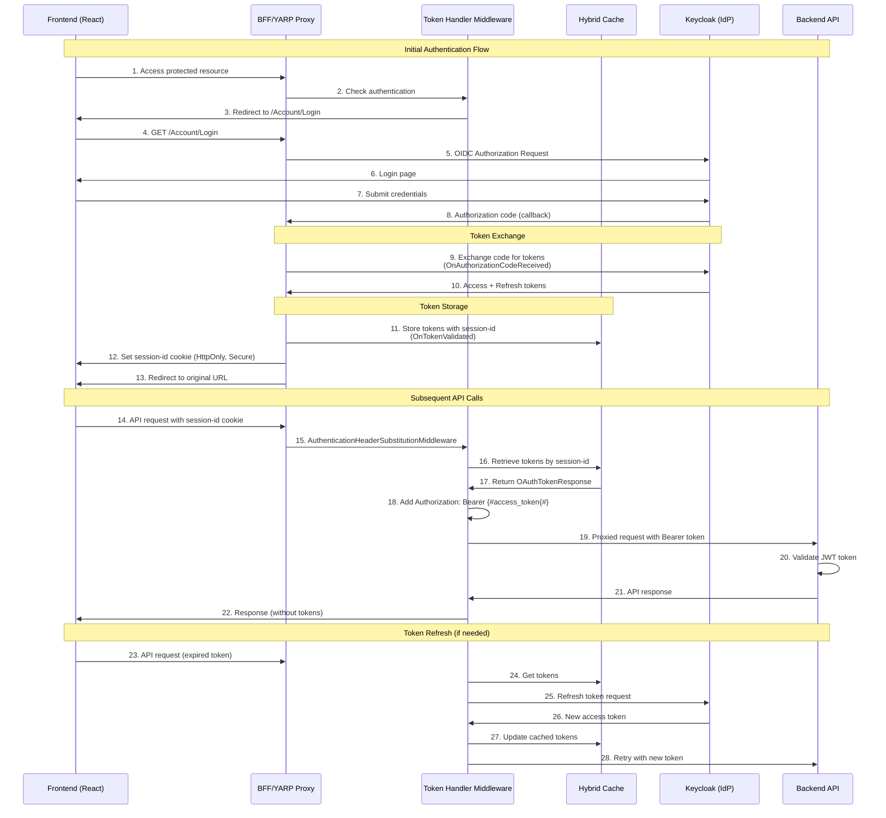

# Sample Application

This is a proof of concept application that demonstrates the integration of:
- ASP.NET Core Web API with Keycloak authentication
- Keycloak for identity and access management
- YARP reverse proxy
- React minimalistic frontend
- Docker Compose setup

## Usage in YAPP projects

In Program.CS of your YAPP project, you can add the token handler as follows:

```csharp
  builder.Services.AddTokenHandler(options =>
        {
            options.Authority = builder.Configuration.GetValue<string>("Keycloak:Authority");
            options.ClientId = builder.Configuration.GetValue<string>("Keycloak:ClientId");
            options.ClientSecret = builder.Configuration.GetValue<string>("Keycloak:ClientSecret");
            options.Realm = builder.Configuration.GetValue<string>("Keycloak:Realm");
        });
```

Where
- Authority is a URL to your Keycloak instance (for instance http://localhost:8080/realms/poc), 
- ClientId is the ID of your Keycloak client
- ClientSecret is the secret of your Keycloak client
- Realm is the name of your Keycloak realm.


## Prerequisites

- Docker and Docker Compose
- .NET 9.0 SDK
- Node.js 16

## Setup Instructions (TODO: clean up this section)

1. Start the application:
```bash
docker-compose build
docker-compose up -d
```

2. Access Keycloak at http://localhost:8080
   - Realm "poc" is already created with a client and a user for testing purposes. See the file `.keycloak/realms/poc-realm.json`.
   - If you want to set it up manually, follow these steps:
   	- Create a new realm named "poc"
   	- Create a new client within this realm:
    	 - Client ID: poc-api
    	 - Client Protocol: openid-connect
    	 - Valid Redirect URIs: http://localhost:3000/*
    	 - Web Origins: http://localhost:3000
   	- Create a new user:
    	 - Username: test
    	 - Email: test@example.com
    	 - Password: test123
    	 - Password not temporary
    	 - Email Verified: true
    	- Get the client secret - needed for the API configuration
      - poc-api client
      - Credentials tab
      - Copy the "Client secret"

3. Access the application:
   - Frontend: http://localhost:3000
   - API: http://localhost:5000/api
   - Keycloak: http://localhost:8080
4. Add keycloak host name to the hosts file

127.0.0.1 keycloak #this is needed for internal communication with keycloak within docker compose


5. Shut down the application:
```bash
docker-compose down
docker-compose down -v (to remove volumes)
```

## Development

### Backend
```bash
cd samples\Poc.Api
dotnet run
```
### Yarp
```bash
cd samples\Poc.Yarp
dotnet run
```

### Frontend
```bash
cd samples\poc-frontend
npm install
npm run dev
```

## Architecture

- Frontend (React + TypeScript) runs on port 3000
- YARP reverse proxy runs on port 5198
- Backend API runs on port 8080 (internal) 
- Keycloak runs on port 8080
- PostgreSQL runs on port 5432 (internal) 


## Sequence Diagram of the Flow

