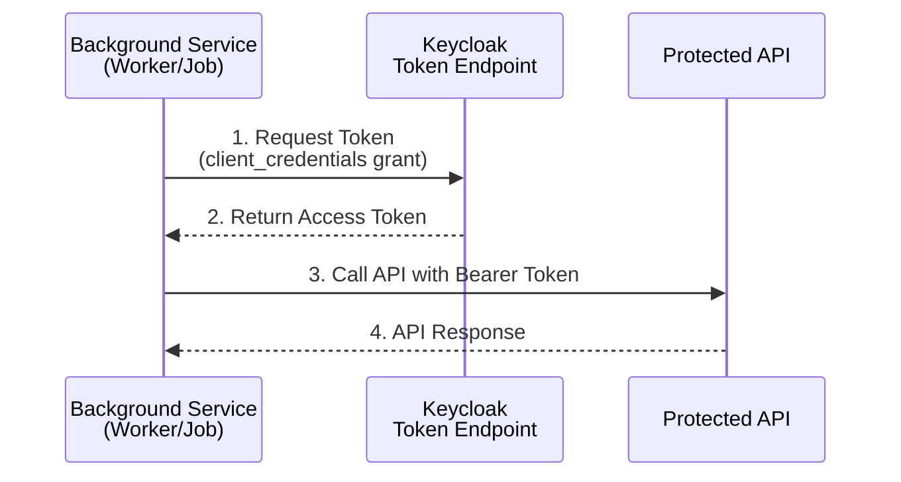

# Background Services Authentication Guide

This guide explains how to authenticate background services such as 
- hosted services
- worker services
- scheduled jobs
 
using the **Client Credentials Grant** flow with OAuth 2.0/OpenID Connect.

## Overview

Background services don't have user interaction, so they cannot use interactive authentication flows like Authorization Code. Instead, they authenticate as **themselves** (machine-to-machine) using the **Client Credentials Grant**.

### When to Use Client Credentials Grant

| Scenario | Grant Type |
|----------|------------|
| User-facing web apps | Authorization Code + PKCE |
| Background services/workers | **Client Credentials** |
| Scheduled jobs/timers | **Client Credentials** |
| Service-to-service communication | **Client Credentials** or Token Exchange |
| Microservice internal calls | **Client Credentials** or Token Exchange |

## Architecture



## Implementation

### Option 1: Using Existing TokenHandlerOptions (Recommended)

If your project already uses `AddTokenHandler`, you can leverage the same `OpenIdConnectOptions` for background services.

#### Step 1: Create a Client Credentials Token Service

```csharp
using Microsoft.AspNetCore.Authentication.OpenIdConnect;
using Microsoft.Extensions.Options;
using System.Text.Json;

namespace YourApp.Services;

/// <summary>
/// Service for acquiring tokens using Client Credentials Grant.
/// Reuses OpenIdConnectOptions from the existing token handler configuration.
/// </summary>
public interface IClientCredentialsTokenService
{
    /// <summary>
    /// Gets an access token for the specified audience using client credentials.
    /// </summary>
    Task<ClientCredentialsResult> GetAccessTokenAsync(
        string? audience = null,
        IEnumerable<string>? scopes = null,
        CancellationToken cancellationToken = default);
}

public class ClientCredentialsTokenService : IClientCredentialsTokenService
{
    private readonly IHttpClientFactory _httpClientFactory;
    private readonly OpenIdConnectOptions _oidcOptions;
    private readonly ILogger<ClientCredentialsTokenService> _logger;

    public ClientCredentialsTokenService(
        IHttpClientFactory httpClientFactory,
        IOptionsMonitor<OpenIdConnectOptions> oidcOptionsMonitor,
        ILogger<ClientCredentialsTokenService> logger)
    {
        _httpClientFactory = httpClientFactory;
        // Get the "oidc" named options configured by AddTokenHandler
        _oidcOptions = oidcOptionsMonitor.Get("oidc");
        _logger = logger;
    }

    public async Task<ClientCredentialsResult> GetAccessTokenAsync(
        string? audience = null,
        IEnumerable<string>? scopes = null,
        CancellationToken cancellationToken = default)
    {
        var tokenEndpoint = await GetTokenEndpointAsync(cancellationToken);
        
        if (string.IsNullOrEmpty(tokenEndpoint))
        {
            return ClientCredentialsResult.Failure("config_error", "Token endpoint not configured");
        }

        var clientId = _oidcOptions.ClientId;
        var clientSecret = _oidcOptions.ClientSecret;

        if (string.IsNullOrEmpty(clientId) || string.IsNullOrEmpty(clientSecret))
        {
            return ClientCredentialsResult.Failure("config_error", "Client credentials not configured");
        }

        var body = new Dictionary<string, string>
        {
            ["grant_type"] = "client_credentials",
            ["client_id"] = clientId,
            ["client_secret"] = clientSecret
        };

        // Add audience if specified (for Keycloak, this targets a specific client)
        if (!string.IsNullOrEmpty(audience))
        {
            body["audience"] = audience;
        }

        // Add scopes if specified
        if (scopes?.Any() == true)
        {
            body["scope"] = string.Join(" ", scopes);
        }

        try
        {
            var httpClient = _httpClientFactory.CreateClient("ClientCredentials");
            var content = new FormUrlEncodedContent(body);
            
            var response = await httpClient.PostAsync(tokenEndpoint, content, cancellationToken);
            var responseContent = await response.Content.ReadAsStringAsync(cancellationToken);

            if (!response.IsSuccessStatusCode)
            {
                _logger.LogWarning("Client credentials request failed: {StatusCode} - {Content}",
                    response.StatusCode, responseContent);
                
                var errorResponse = JsonSerializer.Deserialize<TokenErrorResponse>(responseContent);
                return ClientCredentialsResult.Failure(
                    errorResponse?.Error ?? "request_failed",
                    errorResponse?.ErrorDescription ?? $"HTTP {response.StatusCode}");
            }

            var tokenResponse = JsonSerializer.Deserialize<TokenResponse>(responseContent);
            
            if (tokenResponse is null || string.IsNullOrEmpty(tokenResponse.AccessToken))
            {
                return ClientCredentialsResult.Failure("invalid_response", "No access token in response");
            }

            _logger.LogDebug("Successfully acquired client credentials token");
            return ClientCredentialsResult.Success(
                tokenResponse.AccessToken,
                tokenResponse.ExpiresIn,
                tokenResponse.TokenType);
        }
        catch (Exception ex)
        {
            _logger.LogError(ex, "Error acquiring client credentials token");
            return ClientCredentialsResult.Failure("exception", ex.Message);
        }
    }

    private async Task<string?> GetTokenEndpointAsync(CancellationToken cancellationToken)
    {
        // Try to get from configuration manager (cached discovery document)
        if (_oidcOptions.ConfigurationManager is not null)
        {
            try
            {
                var config = await _oidcOptions.ConfigurationManager.GetConfigurationAsync(cancellationToken);
                return config?.TokenEndpoint;
            }
            catch (Exception ex)
            {
                _logger.LogWarning(ex, "Failed to get token endpoint from discovery");
            }
        }

        // Fallback: construct from authority (Keycloak pattern)
        if (!string.IsNullOrEmpty(_oidcOptions.Authority))
        {
            var authority = _oidcOptions.Authority.TrimEnd('/');
            return $"{authority}/protocol/openid-connect/token";
        }

        return null;
    }
}

public record ClientCredentialsResult(
    bool IsSuccess,
    string? AccessToken,
    int? ExpiresIn,
    string? TokenType,
    string? Error,
    string? ErrorDescription)
{
    public static ClientCredentialsResult Success(string accessToken, int? expiresIn, string? tokenType) =>
        new(true, accessToken, expiresIn, tokenType, null, null);

    public static ClientCredentialsResult Failure(string error, string? description) =>
        new(false, null, null, null, error, description);
}

public record TokenResponse
{
    [System.Text.Json.Serialization.JsonPropertyName("access_token")]
    public string? AccessToken { get; init; }

    [System.Text.Json.Serialization.JsonPropertyName("expires_in")]
    public int? ExpiresIn { get; init; }

    [System.Text.Json.Serialization.JsonPropertyName("token_type")]
    public string? TokenType { get; init; }
}

public record TokenErrorResponse
{
    [System.Text.Json.Serialization.JsonPropertyName("error")]
    public string? Error { get; init; }

    [System.Text.Json.Serialization.JsonPropertyName("error_description")]
    public string? ErrorDescription { get; init; }
}
```

#### Step 2: Register the Service

In your `Program.cs`:

```csharp
// Register HTTP client for client credentials
builder.Services.AddHttpClient("ClientCredentials");

// Register the client credentials service
builder.Services.AddSingleton<IClientCredentialsTokenService, ClientCredentialsTokenService>();
```

#### Step 3: Use in a Background Service

```csharp
public class MyBackgroundService : BackgroundService
{
    private readonly IClientCredentialsTokenService _tokenService;
    private readonly IHttpClientFactory _httpClientFactory;
    private readonly ILogger<MyBackgroundService> _logger;

    public MyBackgroundService(
        IClientCredentialsTokenService tokenService,
        IHttpClientFactory httpClientFactory,
        ILogger<MyBackgroundService> logger)
    {
        _tokenService = tokenService;
        _httpClientFactory = httpClientFactory;
        _logger = logger;
    }

    protected override async Task ExecuteAsync(CancellationToken stoppingToken)
    {
        while (!stoppingToken.IsCancellationRequested)
        {
            try
            {
                // Get a token for the "api" audience
                var tokenResult = await _tokenService.GetAccessTokenAsync(
                    audience: "api",
                    cancellationToken: stoppingToken);

                if (!tokenResult.IsSuccess)
                {
                    _logger.LogError("Failed to get token: {Error} - {Description}",
                        tokenResult.Error, tokenResult.ErrorDescription);
                    await Task.Delay(TimeSpan.FromSeconds(30), stoppingToken);
                    continue;
                }

                // Use the token to call a protected API
                var httpClient = _httpClientFactory.CreateClient();
                httpClient.DefaultRequestHeaders.Authorization = 
                    new System.Net.Http.Headers.AuthenticationHeaderValue("Bearer", tokenResult.AccessToken);

                var response = await httpClient.GetAsync("http://localhost:5149/weatherforecast", stoppingToken);
                var content = await response.Content.ReadAsStringAsync(stoppingToken);
                
                _logger.LogInformation("API Response: {Content}", content);
            }
            catch (Exception ex)
            {
                _logger.LogError(ex, "Error in background service");
            }

            await Task.Delay(TimeSpan.FromMinutes(1), stoppingToken);
        }
    }
}
```

### Option 2: Standalone Configuration (No Token Handler Dependency)

If your background service runs independently without `AddTokenHandler`:

```csharp
public class StandaloneClientCredentialsService
{
    private readonly HttpClient _httpClient;
    private readonly IConfiguration _configuration;
    private readonly ILogger<StandaloneClientCredentialsService> _logger;

    public StandaloneClientCredentialsService(
        HttpClient httpClient,
        IConfiguration configuration,
        ILogger<StandaloneClientCredentialsService> logger)
    {
        _httpClient = httpClient;
        _configuration = configuration;
        _logger = logger;
    }

    public async Task<string?> GetAccessTokenAsync(CancellationToken cancellationToken = default)
    {
        var authority = _configuration["Keycloak:Authority"];
        var clientId = _configuration["Keycloak:ClientId"];
        var clientSecret = _configuration["Keycloak:ClientSecret"];

        var tokenEndpoint = $"{authority?.TrimEnd('/')}/protocol/openid-connect/token";

        var body = new Dictionary<string, string>
        {
            ["grant_type"] = "client_credentials",
            ["client_id"] = clientId!,
            ["client_secret"] = clientSecret!
        };

        var content = new FormUrlEncodedContent(body);
        var response = await _httpClient.PostAsync(tokenEndpoint, content, cancellationToken);

        if (response.IsSuccessStatusCode)
        {
            var json = await response.Content.ReadAsStringAsync(cancellationToken);
            var tokenResponse = JsonSerializer.Deserialize<TokenResponse>(json);
            return tokenResponse?.AccessToken;
        }

        _logger.LogError("Failed to get token: {StatusCode}", response.StatusCode);
        return null;
    }
}
```

**Configuration** (`appsettings.json`):

```json
{
  "Keycloak": {
    "Authority": "http://localhost:8080/realms/poc",
    "ClientId": "bff",
    "ClientSecret": "your-client-secret-here"
  }
}
```

## Token Caching (Important!)

For production, you should cache tokens to avoid requesting new ones on every call:

```csharp
public class CachedClientCredentialsTokenService : IClientCredentialsTokenService
{
    private readonly IClientCredentialsTokenService _inner;
    private readonly IMemoryCache _cache;
    private readonly ILogger<CachedClientCredentialsTokenService> _logger;

    public CachedClientCredentialsTokenService(
        IClientCredentialsTokenService inner,
        IMemoryCache cache,
        ILogger<CachedClientCredentialsTokenService> logger)
    {
        _inner = inner;
        _cache = cache;
        _logger = logger;
    }

    public async Task<ClientCredentialsResult> GetAccessTokenAsync(
        string? audience = null,
        IEnumerable<string>? scopes = null,
        CancellationToken cancellationToken = default)
    {
        var cacheKey = $"client_credentials:{audience ?? "default"}:{string.Join(",", scopes ?? [])}";

        if (_cache.TryGetValue<ClientCredentialsResult>(cacheKey, out var cachedResult))
        {
            _logger.LogDebug("Using cached client credentials token");
            return cachedResult!;
        }

        var result = await _inner.GetAccessTokenAsync(audience, scopes, cancellationToken);

        if (result.IsSuccess && result.ExpiresIn.HasValue)
        {
            // Cache for 80% of token lifetime to allow for clock skew
            var cacheTime = TimeSpan.FromSeconds(result.ExpiresIn.Value * 0.8);
            _cache.Set(cacheKey, result, cacheTime);
            _logger.LogDebug("Cached client credentials token for {Duration}", cacheTime);
        }

        return result;
    }
}
```

## Keycloak Configuration

### Creating a Client for Background Services

1. In Keycloak Admin Console, go to **Clients** ? **Create Client**
2. Configure the client:
   - **Client ID**: `background-worker` (or your service name)
   - **Client authentication**: `ON` (enables client credentials)
   - **Authentication flow**: Check only `Service accounts roles`
3. Go to **Credentials** tab and copy the **Client Secret**
4. Under **Service account roles**, assign appropriate roles

### Using Existing BFF Client

If you want to reuse the existing `bff` client (which already has Client Credentials enabled):

```
POST http://localhost:8080/realms/poc/protocol/openid-connect/token
Content-Type: application/x-www-form-urlencoded

grant_type=client_credentials&client_id=bff&client_secret=your-client-secret-here
```

Test this in the `Test.Yarp.http` file (see "Get Client Credentials Grant Type from KeyCloak" section).

## Security Best Practices

1. **Use separate clients** for background services vs. user-facing apps
2. **Limit scopes** - Request only the scopes your service needs
3. **Rotate secrets** - Regularly rotate client secrets
4. **Use short token lifetimes** - Configure appropriate expiration
5. **Cache tokens** - Don't request new tokens for every API call
6. **Monitor usage** - Log and alert on authentication failures

## Comparison: Client Credentials vs Token Exchange

| Aspect | Client Credentials | Token Exchange |
|--------|-------------------|----------------|
| Use Case | Machine-to-machine, no user context | Delegated access on behalf of user |
| User Identity | No user, service identity only | Preserves original user identity |
| Audit Trail | Logged as service account | Logged as original user |
| When to Use | Background jobs, scheduled tasks | BFF ? API calls, microservice chains |

### When to Use Each

- **Client Credentials**: Your background service needs to access resources as itself, not on behalf of any user
- **Token Exchange**: Your service received a user token and needs to call downstream services while preserving the user's identity

## Example Test Requests

See `samples/Poc.Yarp/Test.Yarp.http` for working examples:

```http
### Get Client Credentials Grant Type from KeyCloak
POST http://localhost:8080/realms/poc/protocol/openid-connect/token
Content-Type: application/x-www-form-urlencoded
  
grant_type=client_credentials&client_id=bff&client_secret=your-client-secret-here
```

## Troubleshooting

### Common Errors

| Error | Cause | Solution |
|-------|-------|----------|
| `invalid_client` | Wrong client ID or secret | Verify credentials in Keycloak |
| `unauthorized_client` | Client not configured for client_credentials | Enable "Service accounts roles" in Keycloak |
| `invalid_scope` | Requested scope not allowed | Configure scopes in client settings |
| Connection refused | Keycloak not running | Start Keycloak with `docker-compose up -d` |