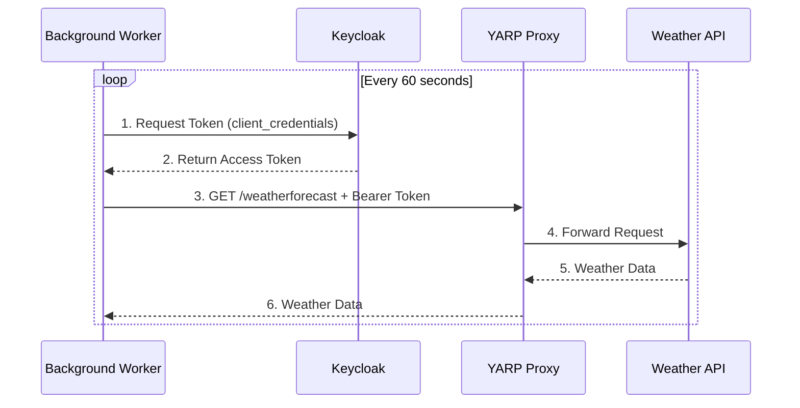

# Poc.BackgroundWorker

A demonstration of **Client Credentials Grant** authentication for background services in .NET 9.

## Overview

This project shows how to authenticate a background worker service using machine-to-machine (M2M) authentication with OAuth 2.0 Client Credentials Grant. The worker periodically calls the Weather API through YARP, demonstrating secure service-to-service communication without user interaction.

## Architecture



## Features

- ? **Client Credentials Authentication** - Uses OAuth 2.0 Client Credentials Grant
- ? **OpenIdConnectOptions Reuse** - Leverages existing OIDC configuration
- ? **Periodic API Calls** - Configurable polling interval
- ? **Comprehensive Logging** - Detailed logs for debugging and monitoring
- ? **Error Handling** - Graceful error recovery and retry logic

## Configuration

### appsettings.json

```json
{
  "Keycloak": {
    "Authority": "http://localhost:8080/realms/poc",
    "ClientId": "bff",
    "ClientSecret": "your-client-secret-here"
  },
  "YarpApi": {
    "BaseUrl": "http://localhost:5198"
  },
  "BackgroundWorker": {
    "PollingIntervalSeconds": 60,
    "ApiAudience": "api"
  }
}
```

### Configuration Options

| Setting | Description | Default |
|---------|-------------|---------|
| `Keycloak:Authority` | Keycloak realm URL | `http://localhost:8080/realms/poc` |
| `Keycloak:ClientId` | OAuth client ID | `bff` |
| `Keycloak:ClientSecret` | OAuth client secret | - |
| `YarpApi:BaseUrl` | YARP proxy base URL | `http://localhost:5198` |
| `BackgroundWorker:PollingIntervalSeconds` | Seconds between API calls | `60` |
| `BackgroundWorker:ApiAudience` | Target audience for token exchange | `api` |

## Prerequisites

1. **Keycloak** running at `http://localhost:8080`
   - Realm: `poc`
   - Client: `bff` with client credentials enabled
   
2. **YARP Proxy** running at `http://localhost:5198`
   ```bash
   cd samples/Poc.Yarp
   dotnet run
   ```

3. **Weather API** running at `http://localhost:5149` (proxied through YARP)
   ```bash
   cd samples/Poc.Api
   dotnet run
   ```

## Running the Service

### Development

```bash
cd samples/Poc.BackgroundWorker
dotnet run
```

### With Docker Compose

```bash
docker-compose up -d
```

## How It Works

### 1. Service Registration (Program.cs)

The service uses `OpenIdConnectOptions` to configure authentication:

```csharp
builder.Services.Configure<OpenIdConnectOptions>("oidc", options =>
{
    options.Authority = builder.Configuration["Keycloak:Authority"];
    options.ClientId = builder.Configuration["Keycloak:ClientId"];
    options.ClientSecret = builder.Configuration["Keycloak:ClientSecret"];
});

builder.Services.AddSingleton<IClientCredentialsTokenService, ClientCredentialsTokenService>();
builder.Services.AddHostedService<WeatherBackgroundService>();
```

### 2. Token Acquisition

`ClientCredentialsTokenService` obtains tokens using the Client Credentials flow:

```csharp
var tokenResult = await _tokenService.GetAccessTokenAsync(
    audience: "api",
    cancellationToken: cancellationToken);
```

### 3. API Call

The worker uses the token to call the Weather API:

```csharp
httpClient.DefaultRequestHeaders.Authorization = 
    new AuthenticationHeaderValue("Bearer", tokenResult.AccessToken);

var response = await httpClient.GetAsync("http://localhost:5198/weatherforecast");
```

## Project Structure

```
Poc.BackgroundWorker/
??? Program.cs                              # Service host configuration
??? appsettings.json                        # Configuration
??? Services/
?   ??? ClientCredentialsTokenService.cs    # Token acquisition service
??? Workers/
    ??? WeatherBackgroundService.cs         # Background worker implementation
```

## Key Classes

### ClientCredentialsTokenService

Implements `IClientCredentialsTokenService` to acquire access tokens using Client Credentials Grant. Reuses `OpenIdConnectOptions` for configuration.

**Key Methods:**
- `GetAccessTokenAsync()` - Acquires token with optional audience and scopes
- `GetTokenEndpointAsync()` - Discovers or constructs token endpoint URL

### WeatherBackgroundService

Inherits from `BackgroundService` to run periodic tasks. Demonstrates:
- Token acquisition before each API call
- Bearer token usage in HTTP requests
- Error handling and logging
- Configurable polling intervals

## Logging

The service provides detailed logging at different levels:

```
info: Poc.BackgroundWorker.Workers.WeatherBackgroundService[0]
      === Starting Weather API Call ===
info: Poc.BackgroundWorker.Workers.WeatherBackgroundService[0]
      Step 1: Requesting access token for audience 'api'...
info: Poc.BackgroundWorker.Services.ClientCredentialsTokenService[0]
      Successfully acquired client credentials token (expires in 300s)
info: Poc.BackgroundWorker.Workers.WeatherBackgroundService[0]
      ? Access token acquired successfully (type: Bearer, expires in: 300s)
info: Poc.BackgroundWorker.Workers.WeatherBackgroundService[0]
      Step 2: Calling Weather API at http://localhost:5198/weatherforecast...
info: Poc.BackgroundWorker.Workers.WeatherBackgroundService[0]
      ? Weather API call successful (Status: 200)
info: Poc.BackgroundWorker.Workers.WeatherBackgroundService[0]
      Weather forecast received: 5 entries, first entry: 12/10/2024 - 75°F (Warm)
```

## Troubleshooting

### "invalid_client" Error

**Cause:** Wrong client ID or secret

**Solution:** 
1. Verify credentials in Keycloak Admin Console
2. Check `appsettings.json` matches Keycloak configuration
3. Ensure client secret is correct (regenerate if needed)

### "unauthorized_client" Error

**Cause:** Client not configured for client credentials

**Solution:**
1. Open Keycloak Admin Console
2. Go to Clients ? `bff` ? Settings
3. Enable "Client authentication"
4. Under "Authentication flow", check "Service accounts roles"

### Connection Refused

**Cause:** Services not running

**Solution:**
```bash
# Start Keycloak
docker-compose up -d keycloak

# Start YARP
cd samples/Poc.Yarp && dotnet run

# Start API
cd samples/Poc.Api && dotnet run

# Start Worker
cd samples/Poc.BackgroundWorker && dotnet run
```

### No Logs Appearing

**Cause:** Log level too high

**Solution:** Update `appsettings.json`:
```json
{
  "Logging": {
    "LogLevel": {
      "Poc.BackgroundWorker": "Debug"
    }
  }
}
```

## Related Documentation

- [Background Services Authentication Guide](../../docs/BACKGROUND-SERVICES-AUTHENTICATION.md)
- [OAuth 2.0 Client Credentials Grant (RFC 6749)](https://datatracker.ietf.org/doc/html/rfc6749#section-4.4)
- [.NET Background Services](https://learn.microsoft.com/en-us/dotnet/core/extensions/workers)

## Security Considerations

1. **Client Secret Protection**
   - Never commit secrets to source control
   - Use User Secrets for development: `dotnet user-secrets set "Keycloak:ClientSecret" "your-secret"`
   - Use Azure Key Vault or similar for production

2. **Token Caching**
   - Consider implementing token caching for production
   - See [Token Caching section](../../docs/BACKGROUND-SERVICES-AUTHENTICATION.md#token-caching-important) in the guide

3. **Separate Clients**
   - Use dedicated client IDs for background services
   - Don't reuse user-facing application clients

4. **Minimal Scopes**
   - Request only the scopes needed
   - Configure scope restrictions in Keycloak

## Production Deployment

For production deployments:

1. **Use environment variables** or secure configuration providers
2. **Implement token caching** to reduce token endpoint calls
3. **Add health checks** for monitoring
4. **Configure retry policies** with exponential backoff
5. **Use Application Insights** or similar for telemetry
6. **Run as a systemd service** or in Kubernetes

## Next Steps

- Implement token caching for production use
- Add health check endpoints
- Configure retry policies with Polly
- Add Application Insights telemetry
- Create unit and integration tests
