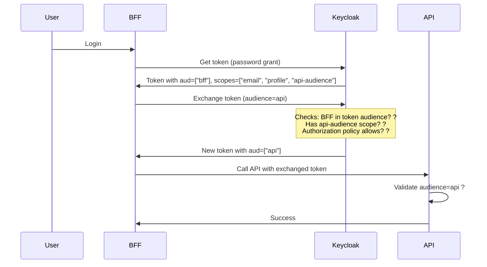

# Token Exchange Configuration - Solution Summary

## Problem
Token exchange from BFF to API was failing with:
```
"Requested audience not available: api"
```

## Root Cause
The BFF client needed explicit permission to request tokens for the `api` audience. This is controlled by **client scopes** in Keycloak.

## Solution Implemented ?

### Changed: BFF Client Scope Configuration
**File**: `.keycloak/realms/poc-realm.json`

**Before**:
```json
"defaultClientScopes": [
  "email",
  "profile"
],
"optionalClientScopes": [
  "api-audience"  // ? Optional scopes must be explicitly requested
]
```

**After**:
```json
"defaultClientScopes": [
  "email",
  "profile",
  "api-audience"  // ? Default scopes are automatically included
],
"optionalClientScopes": [
  // Empty - api-audience moved to default
]
```

## Benefits of This Approach

### 1. **Automatic Scope Inclusion**
- No need to add `&scope=api-audience` to token exchange requests
- Simpler client code
- Less error-prone

### 2. **Consistent Token Exchange**
All token exchanges from BFF ? API now work the same way:
```http
POST /token
grant_type=urn:ietf:params:oauth:grant-type:token-exchange
&client_id=bff
&client_secret=your-client-secret-here
&subject_token={{bffToken}}
&audience=api
```

### 3. **Security Maintained**
- BFF tokens still have ONLY `"aud": ["bff"]`
- API tokens still have ONLY `"aud": ["api"]`
- Audience-based security pattern still enforced

## How It Works

### Default vs Optional Client Scopes

| Scope Type | When Applied | Use Case |
|------------|--------------|----------|
| **Default** | Automatically included in every token request | Core functionality required by all users |
| **Optional** | Only included when explicitly requested | Additional permissions users can opt into |

### Token Exchange Flow (After Fix)



## Testing

### Test 1: Get BFF Token
```http
POST http://localhost:8080/realms/poc/protocol/openid-connect/token
Content-Type: application/x-www-form-urlencoded

grant_type=password
&client_id=bff
&client_secret=your-client-secret-here
&username=admin
&password=admin123
```

**Expected Token Claims**:
```json
{
  "aud": "bff",
  "sub": "...",
  "email": "admin@example.com",
  "name": "Admin User",
  "scope": "profile email"  // api-audience scope is present but not shown in scope claim
}
```

### Test 2: Exchange BFF ? API (No Explicit Scope Needed)
```http
POST http://localhost:8080/realms/poc/protocol/openid-connect/token
Content-Type: application/x-www-form-urlencoded

grant_type=urn:ietf:params:oauth:grant-type:token-exchange
&client_id=bff
&client_secret=your-client-secret-here
&subject_token={{bffToken}}
&subject_token_type=urn:ietf:params:oauth:token-type:access_token
&audience=api
```

**Expected Token Claims**:
```json
{
  "aud": "api",  // ? Changed to API audience
  "sub": "...",
  "email": "admin@example.com",
  "name": "Admin User",
  "scope": "profile email"
}
```

### Test 3: Use Exchanged Token
```http
GET http://localhost:5001/weatherforecast
Authorization: Bearer {{apiToken}}
```

**Expected**: `200 OK` with weather data

## Rollback Instructions

If you need to revert this change:

1. **Edit** `.keycloak/realms/poc-realm.json`:
   ```json
   "defaultClientScopes": ["email", "profile"],
   "optionalClientScopes": ["api-audience"]
   ```

2. **Restart Keycloak**:
   ```bash
   docker-compose restart keycloak
   ```

3. **Update token exchange requests** to include explicit scope:
   ```
   &scope=api-audience
   ```

## Alternative Approaches Considered

### Option 1: Request Scope Explicitly ?
```
&audience=api&scope=api-audience
```
- **Pros**: More explicit control
- **Cons**: More complex, error-prone, requires updating all exchange requests

### Option 2: Move to Default Scopes ? (Chosen)
- **Pros**: Automatic, simpler, less error-prone
- **Cons**: api-audience always included (acceptable for this use case)

### Option 3: Use Client Scope Mappings
- **Pros**: Fine-grained control
- **Cons**: More complex configuration, harder to maintain

## Related Files

- **Configuration**: `.keycloak/realms/poc-realm.json`
- **Update Script**: `.keycloak/update-bff-scopes.ps1`
- **Tests**: `samples/Poc.Yarp/Test.Yarp.http`
- **Architecture Docs**: 
  - `samples/Poc.Yarp/AUDIENCE-SECURITY-PATTERN.md`
  - `samples/Poc.Yarp/TOKEN-EXCHANGE-QUICKREF.md`

## Next Steps

1. ? **Restart Keycloak** to apply the changes:
   ```bash
   docker-compose restart keycloak
   ```

2. ? **Test token exchange** using Step 3 in `Test.Yarp.http`

3. ? **Verify the exchanged token** has:
   - `"aud": "api"`
   - All user claims (`sub`, `email`, `name`, etc.)

4. ? **Update production configuration** when deploying

## References

- [RFC 8693 - OAuth 2.0 Token Exchange](https://www.rfc-editor.org/rfc/rfc8693.html)
- [Keycloak Token Exchange Documentation](https://www.keycloak.org/docs/latest/securing_apps/index.html#_token-exchange)
- [OpenID Connect Scopes](https://openid.net/specs/openid-connect-core-1_0.html#ScopeClaims)
